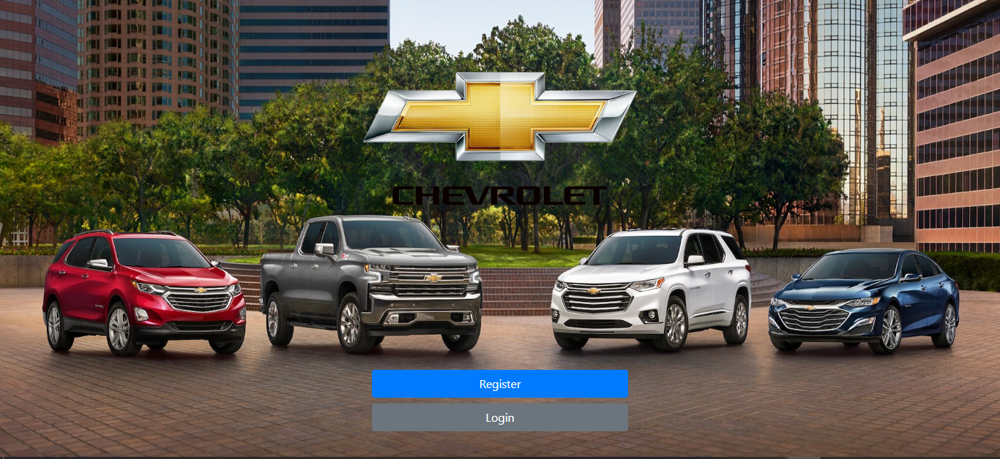

# Unoffical Chevrolte Auto shop.
This project is a simple web app with CRUD operations,
i used a HTML, CSS and JS for the front end, NodeJS in the back and MongoDB Atlas cloud for a NoSQL database system.
(images a stored in an S3 bucket)

In case you want to use my app as is yourself will need to prepare the following:

In your MongoDB account you should have:
Cluster named cluster1, a database named 'chevroletGarage' and 2 collections 'treatments' and 'users'.

Go to 'webProj-master\webProj-master\models\db.js' and update your password and user name from your MongoDB account.

run

npm install

npm start

