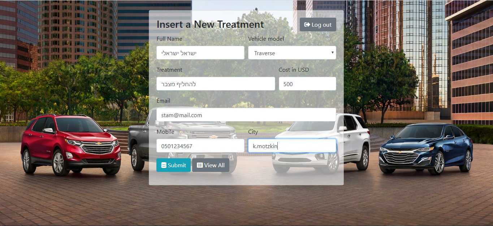
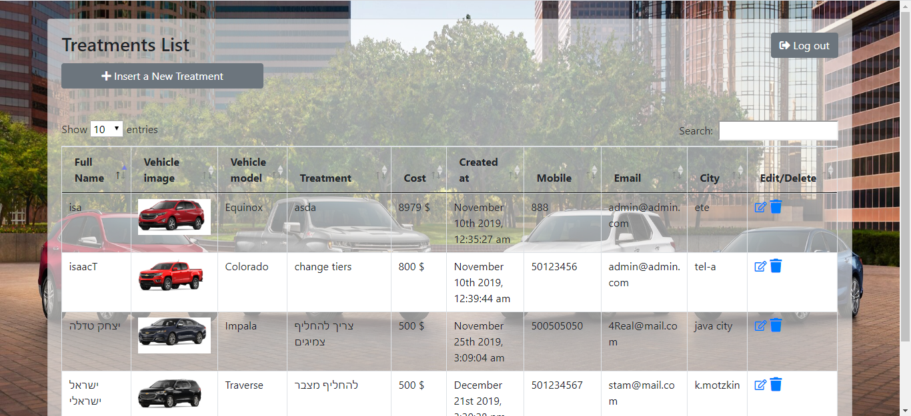

# Unoffical Chevrolte Auto shop.

This project is a simple web app with CRUD operations,
i used a HTML, CSS and JS for the front end, NodeJS in the back and MongoDB Atlas cloud for a NoSQL database system.
(images a stored in an S3 bucket just fot practice)


## Getting Started
In case you want to use it yourself you will need to prepare the following:

In your MongoDB account you should have:
Cluster named cluster1, a database named 'chevroletGarage' and 2 collections 'treatments' and 'users'.

Go to '.env_sample' update your password and user name from your MongoDB account and change file name to '.env'.

```
run
```
```
npm install
```
```
npm start
```

Home page


Inserting a treatment page


Tabel page

